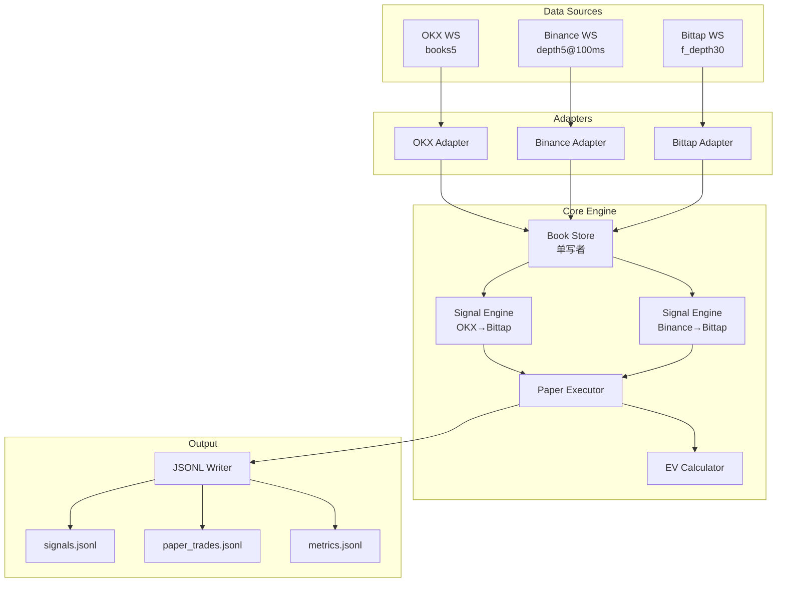
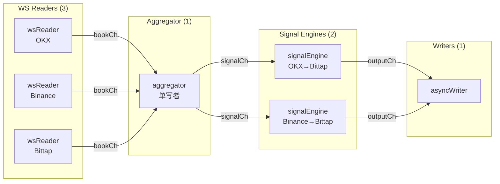

# Design Document: Latency Arbitrage Validator

## Overview

本系统是一个 Go 语言实现的延迟套利验证器，用于测量 OKX/Binance（Leader）与 Bittap（Follower）之间 USDT 永续合约的价格传播延迟，并通过影子成交验证套利策略的可行性。

系统采用事件驱动架构，通过 WebSocket 实时接收三家交易所的订单簿数据，归一化后进行 lead-lag 分析和影子成交模拟。所有统计结果持久化到 JSONL 文件，便于离线分析。

**核心约束**：
- 严禁真实下单，仅采集公共行情
- OKX→Bittap 与 Binance→Bittap 两条链路独立统计
- 单进程、4 核、IPv4、GCP Tokyo 部署

## Architecture

### High-Level Architecture



### Goroutine Architecture



## Components and Interfaces

### 1. Config Module (`internal/config`)

负责加载和验证 YAML 配置文件。

```go
// Config 应用配置根结构
type Config struct {
    App      AppConfig      `yaml:"app"`
    Symbols  []SymbolConfig `yaml:"symbols"`
    Metadata MetadataConfig `yaml:"metadata"`
    WS       WSConfig       `yaml:"ws"`
    Fees     FeesConfig     `yaml:"fees"`
    Strategy StrategyConfig `yaml:"strategy"`
    Paper    PaperConfig    `yaml:"paper"`
    Output   OutputConfig   `yaml:"output"`
}

// Load 从文件加载配置并验证
func Load(path string) (*Config, error)

// Validate 验证配置合法性
func (c *Config) Validate() error
```

### 2. Metadata Module (`internal/metadata`)

负责从三家交易所获取合约元数据并构建 Symbol 映射。

```go
// SymbolMap 交易对映射表
type SymbolMap struct {
    Canon       string // 内部统一标识: BTCUSDT
    OKXInstId   string // OKX: BTC-USDT-SWAP
    BinanceSym  string // Binance: btcusdt
    BittapSym   string // Bittap: BTC-USDT-M
    BittapTick  string // Bittap 档位: 0.1
    TickSize    float64
}

// Fetcher 元数据获取器
type Fetcher interface {
    FetchOKX(ctx context.Context, url string) ([]OKXInstrument, error)
    FetchBinance(ctx context.Context, url string) ([]BinanceSymbol, error)
    FetchBittap(ctx context.Context, url string) (*BittapExchangeInfo, error)
}

// BuildSymbolMaps 构建 Symbol 映射表
func BuildSymbolMaps(ctx context.Context, cfg *config.Config, f Fetcher) (map[string]*SymbolMap, error)
```

### 3. Exchange Adapters (`internal/exchange`)

每个交易所一个子包，负责 WS 连接、消息解析、心跳维护。

```go
// BookEvent 统一订单簿事件
type BookEvent struct {
    Exchange        string    // okx|binance|bittap
    SymbolCanon     string    // BTCUSDT
    BestBidPx       float64
    BestBidQty      float64
    BestAskPx       float64
    BestAskQty      float64
    Levels          []Level   // Top 5 深度
    ArrivedAtUnixNs int64     // 本机收到时间（纳秒）
    ExchTsUnixMs    int64     // 交易所时间（毫秒），Bittap=0
    Seq             int64     // 序列号
}

// Level 深度档位
type Level struct {
    Price float64
    Qty   float64
}

// Client WebSocket 客户端接口
type Client interface {
    Connect(ctx context.Context) error
    Subscribe(symbols []string) error
    Read(ctx context.Context) (<-chan BookEvent, <-chan error)
    Close() error
    Metrics() ConnectionMetrics
}

// ConnectionMetrics 连接质量指标
type ConnectionMetrics struct {
    ReconnectCount   int64
    ParseErrorCount  int64
    UpdatesPerSec    float64
    LastMessageAgeMs int64
    WsRttMs          int64 // 仅 OKX
}
```

#### OKX Adapter (`internal/exchange/okx`)

- 连接: `wss://ws.okx.com:8443/ws/v5/public`
- 订阅: `{"op":"subscribe","args":[{"channel":"books5","instId":"BTC-USDT-SWAP"}]}`
- 心跳: 文本 `ping`/`pong`，25s 间隔，10s 超时
- 解析: `ts` → ExchTsUnixMs, `seqId` → Seq

#### Binance Adapter (`internal/exchange/binance`)

- 连接: `wss://fstream.binance.com/ws`
- 订阅: `{"method":"SUBSCRIBE","params":["btcusdt@depth5@100ms"],"id":1}`
- 心跳: 协议层 ping/pong
- 解析: `E` → ExchTsUnixMs, Seq=0

#### Bittap Adapter (`internal/exchange/bittap`)

- 连接: `wss://stream.bittap.com/endpoint?format=JSON`
- 订阅: `{"method":"SUBSCRIBE","params":["f_depth30@BTC-USDT-M_0.1"],"id":"xxx"}`
- 心跳: JSON `{"method":"PING"}`, 18s 间隔
- 解析: ExchTsUnixMs=0, `lastUpdateId` → Seq

### 4. Core Module (`internal/core`)

#### Book Store (`internal/core/store`)

维护三家交易所最新订单簿状态，单写者模式。

```go
// Store 订单簿存储
type Store struct {
    books map[string]map[string]*BookEvent // exchange -> symbol -> book
}

// Update 更新订单簿（仅 aggregator 调用）
func (s *Store) Update(event *BookEvent)

// Get 获取指定交易所和 Symbol 的最新订单簿
func (s *Store) Get(exchange, symbol string) *BookEvent

// GetPair 获取 Leader-Follower 配对
func (s *Store) GetPair(leader, symbol string) (leaderBook, followerBook *BookEvent)
```

#### Signal Engine (`internal/core/signal`)

检测套利信号并应用过滤器。

```go
// Signal 套利信号
type Signal struct {
    Leader      string    // okx|binance
    SymbolCanon string
    Side        Side      // long|short
    SpreadBps   float64   // 入场价差（bps）
    LeaderBook  *BookEvent
    FollowerBook *BookEvent
    DetectedAt  time.Time
}

// Side 方向
type Side string
const (
    SideLong  Side = "long"
    SideShort Side = "short"
)

// Engine 信号引擎
type Engine struct {
    leader     string
    cfg        *config.StrategyConfig
    store      *store.Store
    volTracker *VolatilityTracker
    cooldown   *CooldownTracker
}

// Evaluate 评估当前状态是否产生信号
func (e *Engine) Evaluate(symbol string) *Signal

// ApplyFilters 应用过滤器
func (e *Engine) ApplyFilters(sig *Signal) (passed bool, reason string)
```

#### Paper Executor (`internal/core/paper`)

管理影子仓位的生命周期。

```go
// Position 影子仓位
type Position struct {
    ID          string
    Leader      string
    SymbolCanon string
    Side        Side
    EntryPx     float64
    EntrySpread float64
    EntryTime   time.Time
    ExitPx      float64
    ExitTime    time.Time
    ExitReason  ExitReason
    GrossPnLBps float64
    FeeBps      float64
    NetPnLBps   float64
}

// ExitReason 退出原因
type ExitReason string
const (
    ExitTP      ExitReason = "tp"
    ExitSL      ExitReason = "sl"
    ExitTimeout ExitReason = "timeout"
)

// Executor 影子成交执行器
type Executor struct {
    cfg       *config.PaperConfig
    fees      *config.FeesConfig
    positions map[string]*Position
}

// Open 开仓
func (e *Executor) Open(sig *Signal) *Position

// Evaluate 评估持仓是否应退出
func (e *Executor) Evaluate(pos *Position, leaderBook, followerBook *BookEvent) *Position

// Close 平仓
func (e *Executor) Close(pos *Position, reason ExitReason, exitPx float64) *Position
```

### 5. Stats Module (`internal/stats`)

#### EV Calculator (`internal/stats/ev`)

```go
// EVStats EV 统计
type EVStats struct {
    WinRate      float64 // p
    AvgProfit    float64 // R (bps)
    AvgLoss      float64 // L (bps)
    EffectiveFee float64 // f (bps)
    EV           float64 // 预期收益
    PRequired    float64 // 盈亏平衡胜率
}

// Calculator EV 计算器
type Calculator struct {
    trades []TradeResult
    window int // 滚动窗口大小
}

// Add 添加交易结果
func (c *Calculator) Add(result TradeResult)

// Calculate 计算 EV
func (c *Calculator) Calculate() *EVStats
```

#### Latency Tracker (`internal/stats/latency`)

```go
// LatencyStats 延迟统计
type LatencyStats struct {
    P50Ms float64
    P90Ms float64
    P99Ms float64
    Count int64
}

// Tracker 延迟追踪器
type Tracker struct {
    samples []float64
    maxSize int
}

// Add 添加延迟样本
func (t *Tracker) Add(lagMs float64)

// Stats 获取统计
func (t *Tracker) Stats() *LatencyStats
```

### 6. Output Module (`internal/output`)

#### JSONL Writer (`internal/output/jsonl`)

```go
// Writer 异步 JSONL 写入器
type Writer struct {
    ch     chan interface{}
    file   *os.File
    done   chan struct{}
}

// NewWriter 创建写入器
func NewWriter(path string, bufSize int) (*Writer, error)

// Write 异步写入
func (w *Writer) Write(v interface{})

// Flush 刷新缓冲
func (w *Writer) Flush() error

// Close 关闭写入器
func (w *Writer) Close() error
```

### 7. Utility Module (`internal/util`)

#### Backoff (`internal/util/backoff`)

```go
// Backoff 指数退避
type Backoff struct {
    base   time.Duration
    max    time.Duration
    jitter float64
    attempt int
}

// Next 获取下次重试间隔
func (b *Backoff) Next() time.Duration

// Reset 重置
func (b *Backoff) Reset()
```

#### Fast Parse (`internal/util/fastparse`)

```go
// ParseFloat 快速解析浮点数（避免 fmt.Sprintf）
func ParseFloat(s string) (float64, error)

// ParseInt 快速解析整数
func ParseInt(s string) (int64, error)
```

## Data Models

### BookEvent

| Field | Type | Description |
|-------|------|-------------|
| Exchange | string | 交易所标识: okx, binance, bittap |
| SymbolCanon | string | 统一交易对: BTCUSDT |
| BestBidPx | float64 | 最优买价 |
| BestBidQty | float64 | 最优买量 |
| BestAskPx | float64 | 最优卖价 |
| BestAskQty | float64 | 最优卖量 |
| Levels | []Level | Top 5 深度 |
| ArrivedAtUnixNs | int64 | 本机收到时间（纳秒） |
| ExchTsUnixMs | int64 | 交易所时间（毫秒） |
| Seq | int64 | 序列号 |

### Signal

| Field | Type | Description |
|-------|------|-------------|
| Leader | string | 领先交易所 |
| SymbolCanon | string | 交易对 |
| Side | string | long/short |
| SpreadBps | float64 | 价差（bps） |
| DetectedAt | time.Time | 检测时间 |

### PaperTrade (JSONL Output)

| Field | Type | Description |
|-------|------|-------------|
| leader | string | 领先交易所 |
| symbol_canon | string | 交易对 |
| side | string | long/short |
| t_entry_ns | int64 | 入场时间（纳秒） |
| t_exit_ns | int64 | 出场时间（纳秒） |
| entry_px | float64 | 入场价格 |
| exit_px | float64 | 出场价格 |
| gross_pnl_bps | float64 | 毛利（bps） |
| fee_bps | float64 | 手续费（bps） |
| net_pnl_bps | float64 | 净利（bps） |
| exit_reason | string | tp/sl/timeout |
| ev_snapshot | object | EV 快照（可选） |


## Correctness Properties

*A property is a characteristic or behavior that should hold true across all valid executions of a system-essentially, a formal statement about what the system should do. Properties serve as the bridge between human-readable specifications and machine-verifiable correctness guarantees.*

Based on the acceptance criteria analysis, the following correctness properties have been identified:

### Property 1: Parser Round-Trip Consistency

*For any* valid raw WebSocket message from OKX, Binance, or Bittap, parsing the message to a BookEvent and then serializing back to the exchange-specific format should preserve the essential price and quantity information.

**Validates: Requirements 2.1, 2.3, 2.4, 2.5**

### Property 2: Symbol Normalization Consistency

*For any* valid exchange-specific symbol (OKX instId, Binance symbol, Bittap symbol), normalizing to canonical format and then mapping back should produce the original exchange-specific identifier.

**Validates: Requirements 2.6, 3.2**

### Property 3: Exponential Backoff Bounds

*For any* sequence of connection failures, the backoff intervals should follow exponential growth from base (1s) to max (30s), and each interval should be within ±20% jitter of the calculated value.

**Validates: Requirements 1.3**

### Property 4: Lag Calculation Correctness

*For any* pair of BookEvents from Leader and Follower with valid timestamps, the arrival-based lag should equal Follower.ArrivedAtUnixNs - Leader.ArrivedAtUnixNs, and when Leader has valid ExchTs, the event-based lag should equal Follower.ArrivedAtUnixNs - Leader.ExchTsUnixMs * 1_000_000.

**Validates: Requirements 4.1, 4.2**

### Property 5: Percentile Calculation Correctness

*For any* sequence of lag measurements, the P50, P90, and P99 percentiles should correctly represent the 50th, 90th, and 99th percentile values of the sorted sequence.

**Validates: Requirements 4.3**

### Property 6: Leader Metrics Independence

*For any* sequence of BookEvents, the lag statistics for OKX→Bittap and Binance→Bittap should be maintained independently, with no cross-contamination of measurements.

**Validates: Requirements 4.4**

### Property 7: Signal Detection Correctness

*For any* pair of Leader and Follower BookEvents:
- If Leader.BestBidPx - Follower.BestAskPx > θ_entry, a long signal should be generated
- If Follower.BestBidPx - Leader.BestAskPx > θ_entry, a short signal should be generated
- Otherwise, no signal should be generated

**Validates: Requirements 5.1, 5.2**

### Property 8: Persistence Filter Correctness

*For any* detected signal, the signal should only pass the persistence filter if the spread condition has been continuously met for at least persist_ms milliseconds.

**Validates: Requirements 5.3**

### Property 9: Depth Filter Correctness

*For any* detected signal, the signal should only pass the depth filter if the sum of Leader's top-5 bid/ask quantities multiplied by prices exceeds the configured minimum USD threshold.

**Validates: Requirements 5.4**

### Property 10: Volatility Filter Correctness

*For any* 1-minute window of price changes, if the realized volatility exceeds the configured threshold, all signals during that window should be skipped.

**Validates: Requirements 5.5**

### Property 11: Cooldown Enforcement

*For any* stop-loss exit event, no new signals should be generated for the same leader-symbol pair within the configured cooldown period.

**Validates: Requirements 5.6**

### Property 12: Paper Entry Price Correctness

*For any* signal that passes all filters:
- Long positions should use Follower.BestAskPx as entry price
- Short positions should use Follower.BestBidPx as entry price

**Validates: Requirements 6.1**

### Property 13: Fee Calculation Correctness

*For any* paper trade, the effective fee should equal raw_fee × (1 - rebate_rate), and the total fee_bps should equal 2 × effective_fee × 10000 (entry + exit).

**Validates: Requirements 6.2**

### Property 14: Position Exit Correctness

*For any* open paper position:
- If |current_spread| ≤ (1 - r_tp) × |entry_spread|, exit as TP
- If |current_spread| ≥ (1 + r_sl) × |entry_spread|, exit as SL
- If hold_time > max_hold_ms, exit as Timeout

**Validates: Requirements 6.3, 6.4, 6.5**

### Property 15: PnL Calculation Correctness

*For any* closed paper trade:
- gross_pnl_bps = (exit_px - entry_px) / entry_px × 10000 × direction
- net_pnl_bps = gross_pnl_bps - fee_bps

where direction is +1 for long, -1 for short.

**Validates: Requirements 6.6**

### Property 16: Rolling Statistics Correctness

*For any* sequence of paper trades, the rolling win rate should equal wins / total, average profit should equal mean of positive net_pnl_bps, and average loss should equal mean of absolute negative net_pnl_bps.

**Validates: Requirements 7.1**

### Property 17: EV Formula Correctness

*For any* values of p (win rate), R (avg profit), L (avg loss), and f (fee):
- EV = p × (R - f) + (1 - p) × (-L - f)
- p_required = (L + f) / (R + L)

**Validates: Requirements 7.2, 7.3**

### Property 18: EV Rejection Correctness

*For any* signal generated when the current EV is negative, the signal should be marked as RejectedByEV.

**Validates: Requirements 7.4**

### Property 19: Paper Trade Output Completeness

*For any* paper trade written to paper_trades.jsonl, the JSON object should contain all required fields: leader, symbol_canon, side, t_entry_ns, t_exit_ns, entry_px, exit_px, gross_pnl_bps, fee_bps, net_pnl_bps, exit_reason.

**Validates: Requirements 8.4**

### Property 20: Config Validation Correctness

*For any* configuration:
- Fee rates outside [0, 1] should fail validation
- Non-positive θ_entry, persist_ms, or max_hold_ms should fail validation
- Empty or unmappable symbols should fail validation
- Valid configurations should pass validation

**Validates: Requirements 9.2, 9.3, 9.4, 9.5**

### Property 21: Subscription Message Correctness

*For any* symbol mapping, the generated subscription messages should use the exchange-specific identifiers from the mapping, not hardcoded values.

**Validates: Requirements 1.2, 3.4**

### Property 22: Timestamp Monotonicity

*For any* sequence of BookEvents from the same exchange-symbol pair, the ArrivedAtUnixNs values should be monotonically non-decreasing.

**Validates: Requirements 2.2**

## Error Handling

### WebSocket Errors

| Error Type | Handling |
|------------|----------|
| Connection Failed | Log error, apply exponential backoff, retry |
| Read Timeout | Close connection, trigger reconnect |
| Parse Error | Increment parse_error_count, sample log raw message (rate-limited), continue |
| Heartbeat Timeout | Close connection, trigger reconnect |
| Unexpected Close | Log close code, trigger reconnect |

### Metadata Errors

| Error Type | Handling |
|------------|----------|
| HTTP Error | Log error, fail fast (startup only) |
| Parse Error | Log error, fail fast |
| Symbol Not Found | Log error, fail fast |

### Runtime Errors

| Error Type | Handling |
|------------|----------|
| Channel Full | Log warning, drop oldest (for metrics), block (for trades) |
| File Write Error | Log error, retry with backoff |
| Context Canceled | Initiate graceful shutdown |

### Error Context

All errors must include context using `fmt.Errorf("operation: %w", err)` pattern:
- Exchange name
- Symbol
- Operation being performed
- Original error

## Testing Strategy

### Dual Testing Approach

本项目采用单元测试与属性测试相结合的策略：

- **单元测试**: 验证特定示例、边界情况和错误条件
- **属性测试**: 验证应在所有有效输入上成立的通用属性

### Property-Based Testing Framework

使用 [gopter](https://github.com/leanovate/gopter) 作为 Go 语言的属性测试库。

每个属性测试必须：
- 运行至少 100 次迭代
- 使用注释标记对应的正确性属性：`// **Feature: latency-arbitrage-validator, Property N: property_name**`
- 使用智能生成器约束输入空间

### Test Categories

#### 1. Parser Tests (`internal/exchange/*_test.go`)

- 每个交易所至少 3 条样例消息的解析测试
- 属性测试：Parser Round-Trip (Property 1)
- 边界情况：空消息、畸形 JSON、缺失字段

#### 2. Symbol Mapping Tests (`internal/metadata/mapper_test.go`)

- 元数据 mock 的映射测试
- 属性测试：Symbol Normalization (Property 2)
- 边界情况：未知 symbol、部分匹配

#### 3. Signal Engine Tests (`internal/core/signal/engine_test.go`)

- 属性测试：Signal Detection (Property 7)
- 属性测试：Filter Correctness (Properties 8, 9, 10, 11)
- 边界情况：价差刚好等于阈值、深度为零

#### 4. Paper Executor Tests (`internal/core/paper/executor_test.go`)

- 属性测试：Entry Price (Property 12)
- 属性测试：Exit Conditions (Property 14)
- 属性测试：PnL Calculation (Property 15)
- 状态机测试：TP/SL/Timeout 转换

#### 5. EV Calculator Tests (`internal/stats/ev/calculator_test.go`)

- 属性测试：EV Formula (Property 17)
- 属性测试：Rolling Statistics (Property 16)
- 边界情况：零交易、全胜、全败

#### 6. Config Validation Tests (`internal/config/config_test.go`)

- 属性测试：Config Validation (Property 20)
- 边界情况：边界值、类型错误

#### 7. Backoff Tests (`internal/util/backoff/backoff_test.go`)

- 属性测试：Exponential Backoff (Property 3)
- 边界情况：首次重试、达到最大值

#### 8. Latency Tracker Tests (`internal/stats/latency/tracker_test.go`)

- 属性测试：Percentile Calculation (Property 5)
- 属性测试：Leader Independence (Property 6)
- 边界情况：单个样本、大量样本

### Test File Structure

```
internal/
  config/
    config_test.go
  metadata/
    mapper_test.go
  exchange/
    okx/
      parser_test.go
    binance/
      parser_test.go
    bittap/
      parser_test.go
  core/
    signal/
      engine_test.go
    paper/
      executor_test.go
  stats/
    ev/
      calculator_test.go
    latency/
      tracker_test.go
  util/
    backoff/
      backoff_test.go
```

### Test Execution

```bash
# 运行所有测试
go test ./...

# 运行属性测试（增加迭代次数）
go test ./... -count=1 -v

# 运行特定包的测试
go test ./internal/core/signal/... -v
```

## Code Documentation Standards

### 中文注释规范

本项目所有代码必须使用中文注释，遵循以下规范：

#### 1. 导出类型和函数注释（GoDoc 风格）

```go
// BookEvent 统一订单簿事件结构
// 用于归一化三家交易所的订单簿数据，便于跨交易所分析
type BookEvent struct {
    // Exchange 交易所标识: okx, binance, bittap
    Exchange string
    // SymbolCanon 统一交易对标识: BTCUSDT
    SymbolCanon string
    // ...
}

// Evaluate 评估当前状态是否产生套利信号
// 参数 symbol: 统一交易对标识
// 返回: 检测到的信号，若无信号则返回 nil
func (e *Engine) Evaluate(symbol string) *Signal
```

#### 2. 复杂逻辑内联注释

```go
// 计算入场价差（基点）
// 多头: leader_bid - follower_ask
// 空头: follower_bid - leader_ask
spreadBps := calculateSpread(leaderBook, followerBook, side)

// 应用持续时间过滤器
// 要求价差持续超过阈值 persist_ms 毫秒
if !e.persistenceFilter.Check(spreadBps, now) {
    return nil
}
```

#### 3. 状态机和公式注释

```go
// EV（期望值）计算公式:
// EV = p × (R - f) + (1 - p) × (-L - f)
// 其中:
//   p = 胜率
//   R = 平均盈利（基点）
//   L = 平均亏损（基点）
//   f = 有效手续费（基点）
ev := p*(avgProfit-fee) + (1-p)*(-avgLoss-fee)

// 盈亏平衡胜率计算:
// p_required = (L + f) / (R + L)
pRequired := (avgLoss + fee) / (avgProfit + avgLoss)
```

#### 4. 交易所消息解析注释

```go
// OKX books5 响应字段映射:
// - data[0].bids: 买盘深度 [[价格, 数量, 废弃, 订单数], ...]
// - data[0].asks: 卖盘深度 [[价格, 数量, 废弃, 订单数], ...]
// - data[0].ts: 交易所时间戳（毫秒）
// - data[0].seqId: 序列号
type OKXBooks5Response struct {
    Data []struct {
        Bids  [][]string `json:"bids"`  // 买盘: [价格, 数量, 废弃, 订单数]
        Asks  [][]string `json:"asks"`  // 卖盘: [价格, 数量, 废弃, 订单数]
        Ts    string     `json:"ts"`    // 交易所时间戳（毫秒）
        SeqId int64      `json:"seqId"` // 序列号
    } `json:"data"`
}
```
